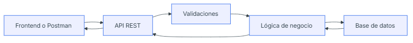

# USER MANAGER API PROJECT

## Descripción
User ManagerApi es una API REST para gestionar usuarios de una app. Permitiendo:
- Registrar usuarios.
- Iniciar Sesión
- Consultar perfiles.
- Modificar datos.
- Gestionar roles.
- Proteger Roles con auteticación.

## Recursos principales
- /auth -> Servirá para registrar usuarios e iniciar sesión.
- /users -> Servirá para consultar, crear, modificar y eliminar usuarios.
- /health -> Servirá para comprobar que la API está funcionando.

## Modelo de usuario
User
- id: PK.
- name: Nombre completo.
- email: Correo electrónico.
- passwordHash: Contraseña.
- role: Rol (USER / ADMIN).
- isActive: Estado en el servidor (ACTIVO / INACTIVO).
- createdAt: Fecha creación.
- updatedAt: Fecha última modificación.

## Endpoints
| Método   | Ruta                     | Descripción                    | Acceso                   |
| -------- | ------------------------ | ------------------------------ | ------------------------ |
| `GET`    | `/api/health`            | Comprueba si la API funciona   | Público                  |
| `POST`   | `/api/auth/register`     | Registra un usuario            | Público                  |
| `POST`   | `/api/auth/login`        | Inicia sesión                  | Público                  |
| `GET`    | `/api/users/me`          | Consulta mi perfil             | Usuario autenticado      |
| `GET`    | `/api/users`             | Lista todos los usuarios       | `ADMIN`                  |
| `GET`    | `/api/users/:id`         | Consulta un usuario por ID     | `ADMIN` o propio usuario |
| `PATCH`  | `/api/users/:id`         | Modifica un usuario            | `ADMIN` o propio usuario |
| `DELETE` | `/api/users/:id`         | Elimina o desactiva un usuario | `ADMIN`                  |
| `PATCH`  | `/api/users/me/password` | Cambia mi contraseña           | Usuario autenticado      |
| `PATCH`  | `/api/users/:id/role`    | Cambia el rol de un usuario    | `ADMIN`                  |
| `PATCH`  | `/api/users/:id/status`  | Activa o desactiva un usuario  | `ADMIN`                  |

## Flujo general


El cliente envía una petición a la API. La API valida los datos, aplica la lógica necesaria, consulta o modifica la base de datos y devuelve una respuesta.

## Reglas iniciales
- El email no se puede repetir
- La contraseña no se guarda en texto plano
- La API nunca devuelve passwordHash
- Un USER solo puede acceder a su propia información
- Un ADMIN puede gestionar usuarios
- Un usuario inactivo no puede iniciar sesión

## Reglas propuestas
- La contraseña debe tener al menos 8 caracteres
- El nombre del usuario no puede estar vacío

## Posibles errores
- Intentar registrar un email ya existente → 409 Conflict
- Intentar consultar un usuario que no existe → 404 Not Found

## Diseño de Respuesta Inicial

Ejemplo de respuesta exitosa para el endpoint  **`GET /api/users/me`**:

```json
{
  "id": 1,
  "name": "Fran Rebollo",
  "email": "fran@email.com",
  "role": "USER",
  "isActive": true
}
```

## Descripción propia de API

Imagina que estás en un restaurante:

- Tú eres el cliente.
- La cocina es el programa que tiene la información o realiza el trabajo.
- El camarero es la **API**.

Cuando quieres una pizza, no entras en la cocina a prepararla tú mismo. Le dices al camarero lo que quieres.

1. Pides una pizza al camarero.
2. El camarero lleva tu pedido a la cocina.
3. La cocina prepara la pizza.
4. El camarero te la trae.

Una **API** funciona exactamente igual: recibe una petición de un programa, la lleva al otro programa y devuelve la respuesta.


### Ejemplo real
Una aplicación del tiempo 🌤️ utiliza una API para pedir la temperatura actual a un servidor. La API recibe la petición, obtiene la información y la devuelve a la aplicación para que puedas verla en tu móvil.